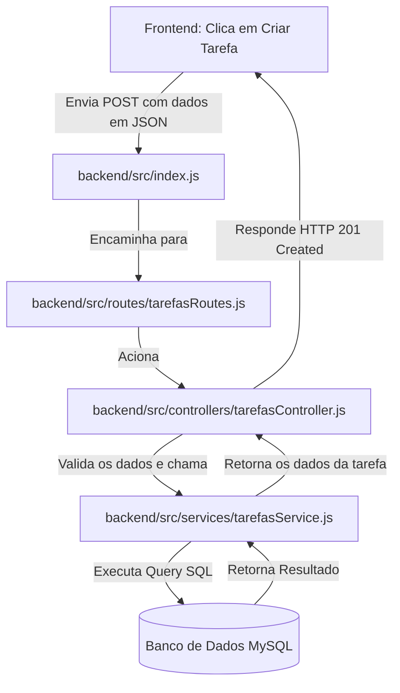

# Guia do Backend: TaskHub 🚀

Este documento foi criado para ajudar os membros do grupo a entenderem como o nosso backend funciona, mesmo sem experiência anterior. Aqui explicamos a arquitetura, os arquivos, as pastas e os conceitos principais da web.

---

## 1. O que é o Backend e uma API?

* **Frontend (O Cliente):** É a interface com a qual o usuário interage diretamente. É responsável por exibir informações, receber dados do usuário e apresentar resultados de forma visual.
* **Backend (A Cozinha):** É a parte do sistema que não é visível para o usuário. Ele é responsável por armazenar, processar e gerenciar os dados do sistema. É onde as regras de negócio são aplicadas.
* **API (O Garçom):** É a ponte que permite que o Frontend se comunique com o Backend. Ele recebe as requisições do frontend, processa e retorna os dados para o frontend.

---

## 2. Conceitos Fundamentais da Web

Quando o frontend se comunica com o backend, ele faz uma **Requisição (Request)** e o backend devolve uma **Resposta (Response)**. Essa conversa usa o protocolo **HTTP**.

### Métodos HTTP (Verbos)
Para dizer o que queremos fazer, usamos "verbos" específicos:
* **GET (Buscar):** Usado quando queremos **pedir** alguma informação do servidor (ex: listar todas as tarefas). Não altera nada no banco de dados.
* **POST (Criar):** Usado quando queremos **enviar** dados novos para serem salvos (ex: cadastrar um novo usuário ou criar uma nova tarefa).
* **PUT (Atualizar):** Usado quando queremos **substituir** ou atualizar todas as informações de algo existente (ex: editar o título e a descrição de uma tarefa).
* **PATCH (Atualizar Parcial):** Semelhante ao PUT, mas usado para alterar apenas um pedaço (ex: marcar uma tarefa como "Concluída", alterando apenas o status).
* **DELETE (Deletar):** Usado quando queremos **remover** algo (ex: excluir uma tarefa).

### JSON (O Formato dos Dados)
As informações viajam entre o frontend e o backend no formato **JSON** (JavaScript Object Notation). Ele se parece com um objeto JavaScript:
```json
{
  "titulo": "Estudar Banco de Dados",
  "descricao": "Revisar comandos do MySQL",
  "id_status": 1
}
```

---

## 3. Estrutura de Pastas do Projeto

Nosso backend está organizado na pasta `backend` usando um padrão que separa as responsabilidades do código (baseado no padrão MVC/Service).

Abaixo está o papel de cada pasta e arquivo dentro de `backend/src`:

* 📂 **`config/`**
  * Contém configurações globais de serviços externos.
  * 📄 [db.js](../src/config/db.js): Configura a conexão e inicializa o nosso banco de dados MySQL.
* 📂 **`routes/`**
  * É a "porta de entrada" das requisições. Define as URLs (endereços) que o frontend pode acessar.
  * 📄 [usuarioRoutes.js](../src/routes/usuarioRoutes.js): Define rotas como `POST /api/usuarios` (para cadastrar usuários).
  * 📄 [tarefasRoutes.js](../src/routes/tarefasRoutes.js): Define rotas como `GET /api/tarefas` (para listar) e `POST /api/tarefas` (para criar tarefas).
* 📂 **`controllers/`**
  * Recebe a requisição das rotas, valida se os dados enviados pelo usuário estão corretos (ex: se o título da tarefa não é vazio) e chama a lógica de negócio correspondente.
* 📂 **`services/`**
  * É onde a mágica acontece. Contém a lógica de negócio pura e o acesso direto ao banco de dados (as queries SQL para inserir, buscar ou atualizar registros).
* 📂 **`middlewares/`**
  * São funções que rodam "no meio do caminho", antes de uma rota chegar ao controller. Servem para segurança, autenticação ou tratamentos de erros.
* 📂 **`utils/`**
  * Funções utilitárias auxiliares que podem ser reutilizadas em várias partes do projeto (ex: formatadores de data, validadores de CPF).
* 📄 [index.js](../src/index.js)
  * É o ponto de partida do nosso servidor. Ele junta todas as rotas, ativa os frameworks necessários e coloca o servidor para rodar em uma porta específica (ex: 3000).

---

## 4. Frameworks e Bibliotecas Utilizadas

No arquivo [package.json](../package.json), você verá as seguintes dependências instaladas:

1. **Express (`express`):**
   * É o nosso framework principal. Ele simplifica muito a criação de rotas, controle de requisições e respostas HTTP no Node.js. Sem ele, teríamos que escrever centenas de linhas de código puro para abrir um servidor básico.
2. **MySQL2 (`mysql2`):**
   * É o driver que permite ao Node.js se comunicar com o banco de dados MySQL. Ele traduz nossos comandos JavaScript em queries que o MySQL entende.
3. **Dotenv (`dotenv`):**
   * Carrega as configurações do arquivo `.env` para o código. Isso nos permite acessar informações confidenciais usando `process.env.NOME_DA_VARIAVEL`.
4. **CORS (`cors`):**
   * *Cross-Origin Resource Sharing*. Por padrão, navegadores bloqueiam sites de acessarem APIs em servidores diferentes (ex: o React rodando na porta 5173 acessando o Node na porta 3000). O CORS avisa ao backend que ele pode aceitar requisições vindas do nosso frontend.

---

## 5. O que é o arquivo `.env`?

O arquivo `.env` (Variáveis de Ambiente) é onde guardamos configurações que variam de acordo com o computador ou que são sensíveis (como senhas do banco de dados).

> [!WARNING]
> **Nunca comite o arquivo `.env` no GitHub!** Ele contém senhas que devem ser mantidas privadas para segurança do projeto.

Para os outros membros rodarem o projeto, nós deixamos o arquivo [`.env.example`](../.env.example) versionado no Git. Ele serve como um modelo contendo as variáveis vazias. 

Para rodar o projeto localmente, cada membro deve:
1. Copiar o arquivo `.env.example`.
2. Renomear a cópia para `.env`.
3. Preencher com as informações do seu próprio MySQL local (e alterar a senha e porta se necessário).

---

## 6. Como Instalar e Configurar o MySQL localmente

Para que a nossa API funcione, você precisa ter um banco de dados MySQL rodando em sua máquina. Siga os passos abaixo:

### Passo 1: Instalação
1. Baixe o **MySQL Installer** para Windows através do [site oficial do MySQL](https://dev.mysql.com/downloads/installer/).
2. Escolha o tipo de instalação **Developer Default** (ou escolha manualmente os pacotes **MySQL Server** e **MySQL Workbench**).
3. Siga o assistente de instalação clicando em *Next/Execute*.

### Passo 2: Definir a Senha (Root Password)
1. Durante a instalação (na etapa *Accounts and Roles*), o instalador pedirá que você defina uma senha para o usuário padrão **`root`**.
2. Defina uma senha que você se lembre facilmente (ex: `Senha123$`).

> [!IMPORTANT]
> **Você precisa atualizar o seu arquivo `.env` com a mesma senha que definiu aqui!** 
> No arquivo `.env`, altere o campo `DB_PASSWORD` para a sua senha:
> ```env
> DB_PASSWORD=SuaSenhaAqui
> ```

### Passo 3: Executar o Script do Banco
1. Abra o **MySQL Workbench**.
2. Conecte-se ao seu servidor local (geralmente na porta `3306`).
3. Abra e execute o arquivo de script do projeto: [banco.sql](../banco.sql). Isso criará automaticamente o banco de dados `bancotaskhub` e todas as tabelas necessárias (`usuarios`, `status`, `tarefas`).

---

## 7. O Fluxo de uma Requisição (Passo a Passo)

Para entender como tudo se conecta, veja o fluxo de criação de uma tarefa:



1. **Frontend:** O usuário digita o título da tarefa no React e clica em salvar. O React faz uma requisição `POST http://localhost:3000/api/tarefas` contendo os dados da tarefa.
2. **Servidor (index.js):** Recebe o POST e passa para o roteador de tarefas.
3. **Rota (tarefasRoutes.js):** Vê que é um `POST` no caminho `/` e chama a função `criarTarefa` no controller.
4. **Controller (tarefasController.js):** Verifica se todos os campos obrigatórios estão preenchidos. Se estiver tudo certo, chama a função de serviço.
5. **Serviço (tarefasService.js):** Recebe os dados, formata as datas no padrão do MySQL, e executa a query `INSERT INTO tarefas...`.
6. **Banco de Dados:** Grava os dados fisicamente.
7. **Retorno:** O serviço avisa o controller que deu certo, e o controller responde ao frontend com o status `201` (Criado com sucesso), permitindo ao React atualizar a lista na tela.
